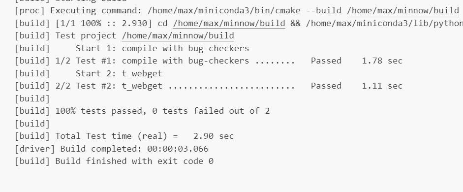
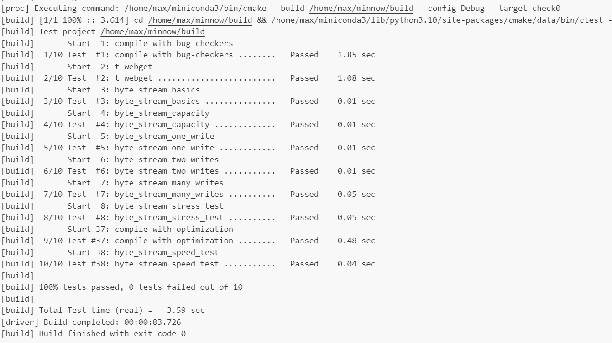

Checkpoint 0 Writeup
====================

My name: 卢郡然

My SUNet ID: 502024330034

This lab took me about 4 hours to do. 


## Implementation of Webget

using `TCPSocket` library to send HTTP requests. 

output the response to std::cout.

```c++
void get_URL(const string& host, const string& path )
{
  cerr << "Function called: get_URL(" << host << ", " << path << ")\n";

  // cerr << "Warning: get_URL() has not been implemented yet.\n";
  TCPSocket sock{};
  sock.connect(Address(host,"http"));
  sock.write("GET "+path+" HTTP/1.1\r\nHost: "+host+"\r\n\r\n");
  sock.shutdown(SHUT_WR);
  string response;
  while (!sock.eof()) {
    sock.read(response);
    cout<<response;
  }
}

```


## Implementation of ByteSteam

#### Program Structure and Design

The ByteStream implementation leverages the `std::deque` container for its internal buffer, as it provides efficient operations at both ends, allowing for push and pop operations in constant time $O(1)$. 

This efficiency is crucial for handling the stream-like behavior, where data is pushed into the buffer by the writer and popped out by the reader.

The writer uses the `push_back() `method of the deque to append data to the buffer. This ensures that the writer can push chunks of data efficiently, even when handling large or partial inputs. 

For the reader, `pop_front()` is used to remove data from the front of the buffer, simulating the consumption of the stream. This mechanism ensures that the data is removed once it is read, respecting the natural flow of the stream.

To offer a non-intrusive view of the data for peek operations, I used std::string_view. This C++ feature allows for a read-only view into the string data, which avoids unnecessary copying of the underlying data, improving performance. Using string_view is ideal for the peek operation, where the reader needs a snapshot of the data without modifying the buffer.

#### Implementation Challenges

The data is stored as segments, which makes the string view inconsistant. So I need to track the front the deque while pushing and poping to obtain a correct string view. I also need to handle the case when the buffer is empty, which is not handled by the string view. 

The primary challenge arose from managing the buffer's segmented data. Since the std::deque stores string in segments, the string_view cannot simply point to a contiguous block of memory. This required careful tracking of the front of the deque as data is pushed and popped, ensuring that the string_view provided to the reader is always consistent and reflects the current state of the buffer.

```C++
void Reader::pop( uint64_t len )
{
  num_bytes_buffered -= len;
  num_bytes_popped += len;
  while ( len >= remain.size() && len != 0 ) {
    len -= remain.size();
    buffer.pop_front();
    remain = buffer.empty() ? ""sv : buffer.front();
  }
  if ( !remain.empty() )
    remain.remove_prefix( len );
}
```


Also handling the case when the buffer is empty is a hard task. Since string_view cannot handle empty or non-existent data natively, additional checks were necessary to manage cases where the buffer was either partially or completely drained.

Managing the end-of-file (EOF) scenario required special handling. The buffer needed to recognize when the writer had closed the stream and ensure that the reader could gracefully finish reading the remaining data.

#### Experimental Results and Performance.

result of check_webget



result of check0

