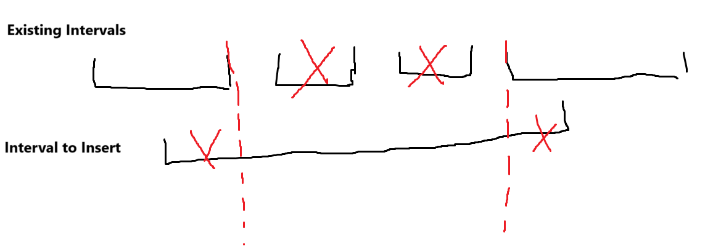
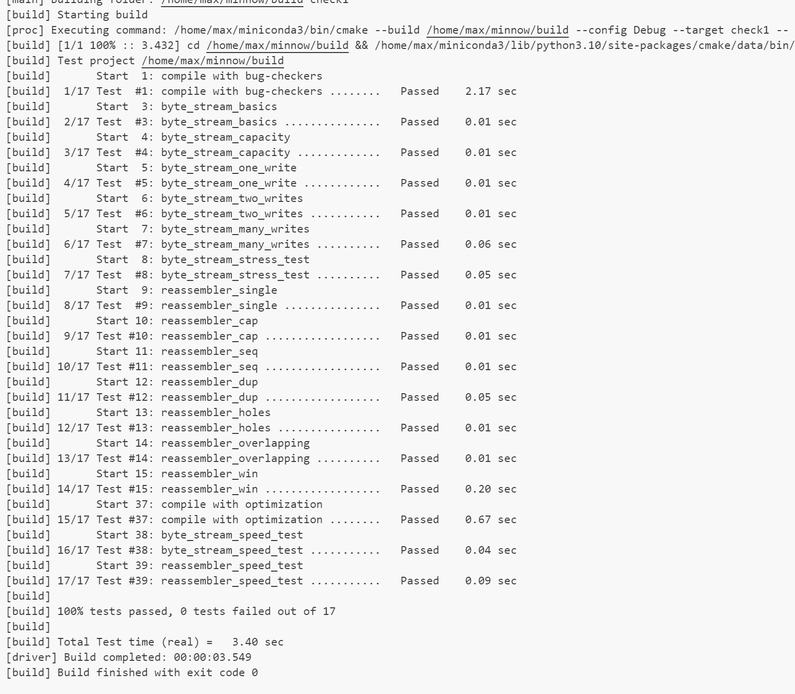

Checkpoint 1 Writeup
====================

My name: 卢郡然

My SUNet ID: 502024330034

This lab took me about 4 hours to do. 


## Implementation of Reassembler

#### Program Structure and Design

This task is easily solved by modeling it to a sliding window. Noting a `head_index` and see if the current buffer reaches this `head_index` is an easy way to implement a reassembler.

But when it comes to counting `bytes_pending`, things get hard. The core problem is how to handle overlapping properly and efficiently, which is effort-paying.

I finally decide to convert the question into a interval union problem.

The core idea is to maintaining non-overlapping intervals along the index axis. This is be implemented by leveraging `std:set`'s  ability to maintain ordered array and find elements, erase elements in $O(\log |S|)$ .

Specifically, the elements are 

```C++
struct Node{
  uint64_t index;
  string data;
  
  Node(uint64_t i, string d): index(i), data(d) {}

  bool operator < (const Node& other) const{
    return index < other.index || (index == other.index && data.length() > other.data.length());
  }
};
```

which is ordered by `index`.

When a new interval $x$ is trying to insert into the set. It is required to maintain the non-overlapping state. The detailed process is shown below:

1. Check intervals which have small left end to  $x$. Shrink the left bound of $x$ if overlapping happens.
2. Check intervals which have equal or greater left end to $x$. Delete existing intervals that fully included by $x$. Shrink right bound of $x$ if the right-most interval has overlaps.



The `btytes_pending` is counted during the process.

All operations above is supported by `std::set`, which contains:1. `set::lower_bound()` to find the corresponding intervals. `set::erase()` to delete intervals.

The find and erase operation has a logarithmic complexity, and the iteration to erase fully included intervals happens to each interval once at most. So the overall time complexity is $O(\log|S|)$.

#### Challenges and Difficulties

The definition of `is_last_substring` is ambitious, which is not mentioned in the document or startup codes.

It really costs me a large mount of time to check the test case to find out the true meaning of the "last string".

The method to handle "last string " is to find the last index. The index of the last character is fixed if the inputs are reasonable, which can be calculated by inputs labeling `is_last_substring = True` :

```c++
if(is_last_substring){
    last_index = first_index + data.length();
  }
```

When pushing index over this `last_index` the true ending is set and the output is closed.

```C++
if(head_index >= last_index){
	writer.close();
}
```


#### Experimental Results and Performance.



I think the performance may be reduced due to the frequent use of `string:substr()` which may lead to high copy cost.

