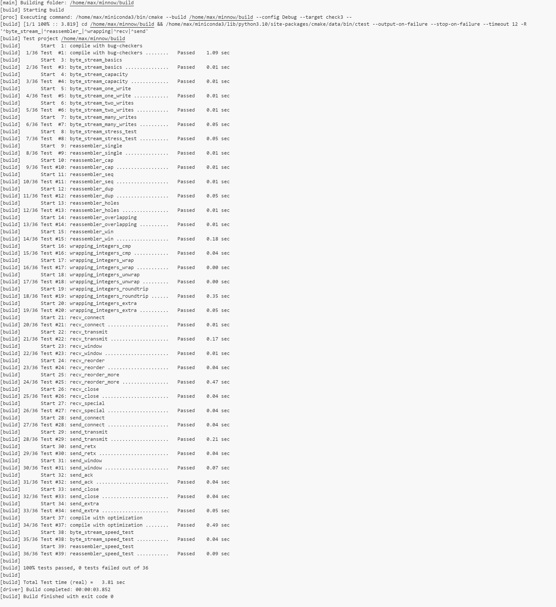

finish all the {COMPLETE}

Checkpoint 3 Writeup
====================

My Student ID: 502024330034

This lab took me about 4 hours to do 

### Program Structure and Design

#### SYN

The SYN set is sent only when:

1. The SYN flag has not been sent yet (`!syn_sent`).
2. No data has been buffered or sent yet, ensuring that the SYN is the first packet sent during the connection setup.

And SYN is counted for the sequence number, as the sequence number is incremented by 1 to account for the SYN packet sent at the beginning of the connection handshake.

The SYN is sent alone or with data, depending on whether there is data to send.

#### payload 

When there is data buffered in `reader`, try fetch the data from `reader` and send it to the receiver. 
If there is data available in the reader (i.e., `head.size() > 0`), the function attempts to send as much data as possible.

The amount of data to send is limited by the available window size, which is calculated as max_size. This ensures that no more data is sent than the receiver can handle or the sender's window allows.

The actual amount of data sent (`delta`) is the smaller value between the size of data available in reader (`head.size()`) and the remaining window size (`max_size - bytes_sent`), further limited by TCPConfig::MAX_PAYLOAD_SIZE.

#### FIN

The FIN flag is set when `reader.is_finished()` is true, indicating that the sender has finished sending all data and is ready to close the connection. But there are few things to consider:

1. The FIN flag counts for sequence number.
2. The FIN flag doesn't count for payload size.
3. The FIN flag may be sent with SYN.

#### timer
When a message is sent the timer is on until the message is acked or the timer expires.

When the timer expires, the first message in the queue is retransmitted.

When all message is acked, the timer is turned off.

The expired time RTO is doubled when a transmission occurs and reset when an ack is received. The cornor case is that when window size is 0, the RTO will not double.

#### ACK

When receiving ACK, a prefix of messages buffered is expected to be acked. Check the ack number and the seqno of the messages in queue, and remove those messages been acked. Invalid ACKs that do not match any of the buffered message sequence numbers or are out of expected order are ignored.

Also, the windows size is determinded by the messgae received.

#### retransmission

Messages sent are buffered in a queue `buffered_messages`, Whenever a message is transmitted (whether it's a data packet or a control packet like SYN or FIN), it is added to buffered_messages. 

When a timeout occurs, the messages in the queue are retransmitted. This is done by checking if the timer has exceeded RTO. The first message in the queue is always retransmitted. 

When transmitting, the retransmission count `retx_cnt` is incremented, and the retransmission timeout multiplier `rto_multiplier` is doubled.

#### RST

The RST flag is set when error occurs or a meesage with RST flag is received. 

### Experimental Results and Performance.

