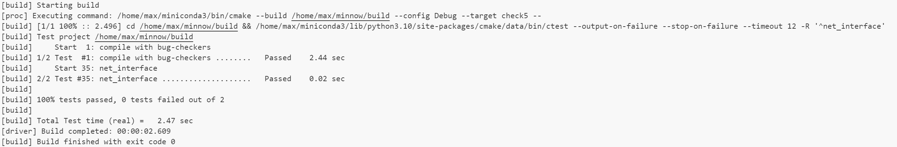

Checkpoint 5 Writeup
====================

My name: 卢郡然

My SUNet ID: 502024330034

### Program Structure and Design

This checkpoint took me about 4 hours to do.

#### Maps

To implement link layer, it is required to know the destination MAC address of the destination IP address, and timestamps which are used for retransmitting or expiring.

Essentilly, they are all information attached to IP address accordingly, so an IP indexed data structure can be used to store them.

I use 3 maps to store these information that attach to IP addrees, which are `arp_cache_`, `send_queue_` and `arp_time_stamp_`.

`arp_cache_`: A cache to store mapping from IP address to MAC address.

`send_queue_`: Buffer for each destination IP address, which is a map from IP address to a queue of packets.

`arp_time_stamp_`:Store the timestamp when the an ARP message is sent or received, which is a map from IP address to timestamp.

When requested to send a message. First check if the destination IP address is in the ARP cache.

If it is not, then send an ARP request message broadcasted to the network expecting to get the MAC address of the destination IP address.

#### Receiving
When a frame is received, check its validity (correctly targeting at this machine) and filter invalid frames.

When receiving an ARP message, update the ARP cache using IP-MAC mapping extracted from the ARP message. If it is a request message, send an ARP reply message to the sender.

When receiving a IP message, pass it to the upper layer.

#### Sending

Frames with destination MAC address unknown are stored in the buffer. 

Method `void NetworkInterface::send_known()` is used to send the message stored in the buffer with already known corresbonding MAC address. 

It is called when requested to send a message, or during possible new addition of entries to ARP cache, which will occur when receiving an ARP message.

#### Timing

A timer is used for two purposes: retransmitting ARP request and expiring ARP cache.

When an ARP request is sent, the timestamp is updated. If the interval is smaller than the threshold ($5s$), then the ARP request will be retransmitted.

When an ARP reply is received, the timestamp is updated. Checking the whole ARP cache periodically, entries with interval larger than the threshold ($30s$) is expired, which will be removed from maps.

### Implementation Challenges

The removal of entries from C++ STL map is tricky since it is not allowed to modify the map during iteration.

Alternatively, I follow the standard associative-container erase idiom instead, which allows to erase an element from the map during iteration.

```C++
for (auto it = arp_time_stamp_.cbegin(); it != arp_time_stamp_.cend(); ){
    if (abs_time_ - it->second > 30000){
      arp_cache_.erase(it->first);
      arp_time_stamp_.erase(it++);
    }else{
      ++it;
    }
  }
```

### Experimental Results and Performance.
