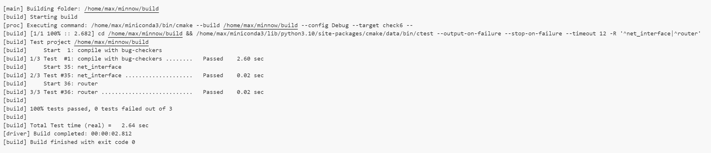

Checkpoint 6 Writeup
====================

My name: 卢郡然

My SUNet ID: 502024330034

This checkpoint took me about 4 hours to do.

#### Program Structure and Design of the Router

Since the routing matching rule uses longest prefix matching, a Trie (prefix tree) can be used to organize the routing table. This approach allows results to be found within 32 query steps.

##### Trie

Since the number of semantic symbols is 2 (binary), each node in the Trie has two children. Each node also retains a routing entry. The design structure is as follows:

```cpp
struct TrieNode
{
  std::unique_ptr<TrieNode> children[2];
  std::optional<RouteEntry> prefix;
  TrieNode(): children{nullptr, nullptr}, prefix(std::nullopt) {}
};
```

To insert a prefix, the Trie is traversed. When an empty node is encountered, a new node is created. Otherwise, the traversal continues downward. At the end of the prefix, the routing entry is attached to the corresponding node.

```cpp
void insert(RouteEntry prefix_order){
    TrieNode* node = &root;
    uint8_t prefix_length = prefix_order.prefix_length;
    uint32_t route_prefix = prefix_order.route_prefix;
    for (int i = 31; i >= 32 - prefix_length; i--) {
      bool bit = (route_prefix >> i) & 1;
      if (node->children[bit] == nullptr) {
        node->children[bit] = std::make_unique<TrieNode>();
      }
      node = node->children[bit].get();
    }
    node->prefix = prefix_order;
  }
```

During a lookup, the Trie is traversed, recording all routing entries encountered along the way. The last (longest prefix) matching entry is returned, which may be empty if no match is found.

```cpp
std::optional<RouteEntry> match(uint32_t ip_address){
    TrieNode* node = &root;
    std::optional<RouteEntry> longest_match = std::nullopt;
    for (int i = 31; i >= 0; i--) {
      if (node->prefix.has_value()) {
        longest_match = node->prefix;
      }
      bool bit = (ip_address >> i) & 1;
      if (node->children[bit] == nullptr) {
        return longest_match;
      }
      node = node->children[bit].get();
    }
    return longest_match;
  }
```

##### Routing
For routing, all entries in the buffer are traversed. Each entry is looked up in the Trie. If a matching entry is found, the packet is forwarded according to the corresponding routing entry. If no match is found, the packet is discarded.

### Experimental Results and Performance.

